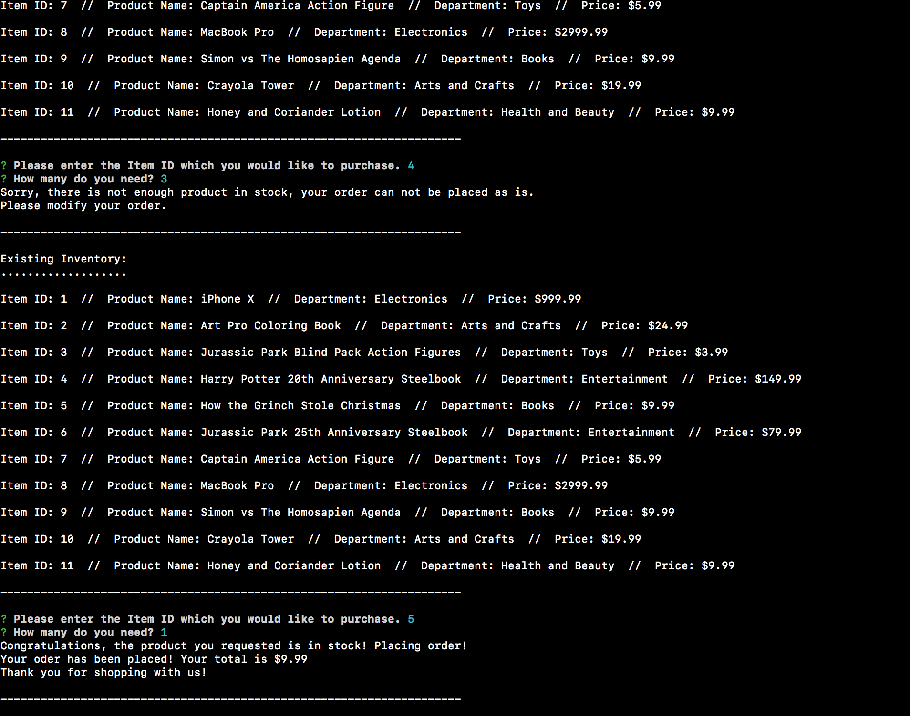

# Bam-azon
I created an Amazon-like storefront with MySQL. The app will take in orders from customers and deplete stock from the store's inventory. 

1. Navigate to bamazonCustomer.js in terminal or bash.
2. node bamazonCustomer.js
3. Look at the stock within my warehouse and choose the number of the item you like
4. Tell the system how many of that product you need
5. There will be a success message if you are able to buy as many as you would like, and an error if there aren't enough in stock.


```



```

